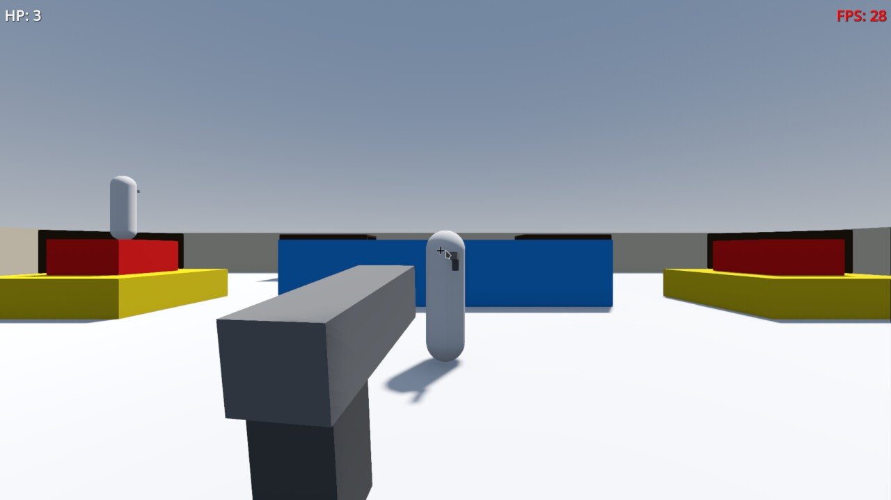

# FPS Test

A prototype first-person shooter. This is meant to be a small-ish project for learning some more [Godot](https://godotengine.org).

Made with [Godot](https://godotengine.org) 4.2.1.

This is still very WIP and not very useful (or fun) yet. See [TODO.md](TODO.md) for the current todo-list.

## Running

The project can probably be started with this version or later. Once it's been opened you need to grab the OpenXR Vendors plugin, enable it and install the Android Build Tmeplate. After that, it can just be run normally the same as any other [Godot](https://godotengine.org) project (the default is the F5 key).

VR is not yet supported, only the initial project configs for it have been done. It's disabled by default in the project settings and would have to be enabled for exports to support it.

The web version can be run by copying `host.py` to the web export folder, running it and browsing to [http://localhost:8000/](http://localhost:8000/).

Also note that the browser verions's controller support is flakey.

## Playing

The game starts up right away at the moment with some static enemies. Every character has 3 HP, so 3 shots to kill. Ammo is infinite for now.

### Controls

* Movement - Arrow keys/WSAD
* Camera - Mouse movement
* Jumping - CTRL/Space
* Aiming - Right-click
* Shooting - Left-click

No controller support or sound (yet), so expect silence.

This project sadly has no mobile support (yet), only PC (Linux and Windows) browser support.
